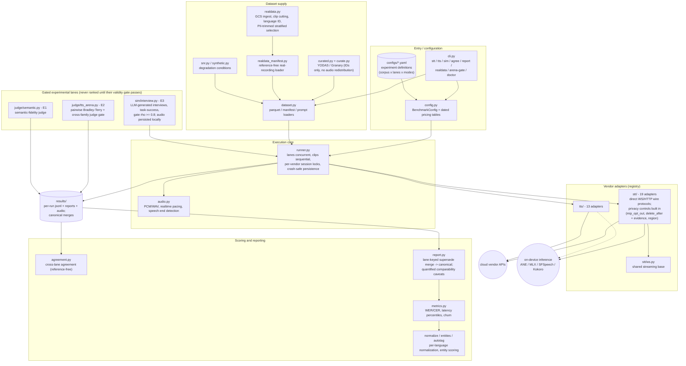

# audio-harness

Cross-vendor STT/TTS benchmark harness. Measures recognition accuracy,
streaming latency and cost across speech vendors under identical audio,
identical pacing and identical text normalization.

Built for choosing a speech stack for a **realtime voice agent**, so the
headline metric is not word error rate — it is how long the user waits after
they stop talking.

## Architecture



Principles that cut across every layer: no same-family judging, lane-keyed
supersede (never mixing corpora in one canonical row), quantified
comparability caveats (hosted-proxy, SDK-buffered, local-compute), gated
isolation for judge-based lanes, and pricing treated as dated data that rots.

## Providers

51 registered lanes (24 STT, 27 TTS). `uv run audio-harness providers`
prints this matrix from the live registry.

### STT

| Key | Model | Batch | Stream |
| --- | --- | --- | --- |
| `stt-rt-v5` | stt-rt-v5 (batch runs stt-async-v5) | yes | yes |
| `nova-3` | Nova-3 | yes | yes |
| `flux-general-en` | Flux (endpointing-first) | — | yes |
| `enhanced` | Enhanced operating point | yes | yes |
| `standard` | Standard operating point | yes | yes |
| `universal-3-5-pro` | Universal-3.5 pro | yes | yes |
| `chirp_3` | Chirp 3 (STT v2, gRPC SDK) | yes | yes |
| `gpt-transcribe` | gpt-transcribe | yes | — |
| `gpt-4o-transcribe` | gpt-4o-transcribe | yes | yes |
| `gpt-4o-transcribe-diarize` | gpt-4o-transcribe-diarize | yes | — |
| `gpt-live-transcribe` | gpt-live-transcribe | — | yes |
| `scribe_v2` | Scribe v2 / v2 realtime | yes | yes |
| `ink-2` | Ink-2 (batch runs ink-whisper) | yes | yes |
| `solaria-1` | Solaria-1 | — | yes |
| `solaria-3` | Solaria-3 | yes | — |
| `voxtral-mini-transcribe-realtime-2602` | Voxtral realtime | — | yes |
| `default` | Azure Speech (SDK; per-locale base model) | — | yes |
| `grok-stt` | Grok STT | yes | yes |
| `nvidia/parakeet-tdt-0.6b-v3` | Parakeet TDT 0.6B v3 (OpenRouter) | yes | — |
| `fish-audio/transcribe-1` | Fish transcribe-1 (OpenRouter) | yes | — |
| `microsoft/mai-transcribe-1.5` | MAI transcribe 1.5 (OpenRouter) | yes | — |
| `SFSpeechRecognizer` | Apple Speech (on-device, $0) | — | yes |
| `parakeet-tdt-0.6b-v3` | Parakeet v3 on Neural Engine ($0) | yes | — |
| `mlx-community/whisper-large-v3-mlx` | whisper-large-v3 MLX ($0) | yes | — |

### TTS

| Key | Model | Batch | Stream |
| --- | --- | --- | --- |
| `eleven_v3` | Eleven v3 | yes | yes |
| `eleven_flash_v2_5` | Flash v2.5 | yes | yes |
| `sonic-3` | Sonic 3.0 | yes | yes |
| `sonic-3.5` | Sonic 3.5 | yes | yes |
| `aura-2-thalia-en` | Aura-2 | yes | yes |
| `gemini-2.5-flash-preview-tts` | Gemini TTS | yes | yes |
| `gemini-3.1-flash-tts-preview` | Gemini 3.1 TTS (preview) | yes | yes |
| `tts-rt-v2` | tts-rt-v2 | yes | yes |
| `inworld-tts-2` | Inworld TTS 2 | yes | yes |
| `voxtral-mini-tts-2603` | Voxtral TTS | yes | yes |
| `gpt-4o-mini-tts-2025-12-15` | gpt-4o-mini-tts | yes | yes |
| `en-US-AvaMultilingualNeural` | Azure Neural (SDK; voice selects the model, ja uses `ja-JP-NanamiNeural`) | — | yes |
| `grok-tts` | Grok TTS (wire request carries no model id) | yes | yes |
| `qwen/qwen-audio-3.0-tts-flash` | Qwen audio-3.0 TTS flash (OpenRouter) | yes | — |
| `qwen/qwen-audio-3.0-tts-plus` | Qwen audio-3.0 TTS plus (OpenRouter) | yes | — |
| `fish-audio/s1` | Fish S1 (OpenRouter) | yes | — |
| `fish-audio/s2-pro` | Fish S2 Pro (OpenRouter) | yes | — |
| `fish-audio/s2.1-pro` | Fish S2.1 Pro (OpenRouter) | yes | — |
| `microsoft/mai-voice-2` | MAI Voice 2 (OpenRouter) | yes | — |
| `microsoft/mai-voice-2-flash` | MAI Voice 2 Flash (OpenRouter) | yes | — |
| `deepgram/flux-tts:free` | Deepgram Flux TTS :free (OpenRouter) | yes | — |
| `minimax/speech-2.8-turbo` | MiniMax speech-2.8 turbo (OpenRouter) | yes | — |
| `minimax/speech-2.8-hd` | MiniMax speech-2.8 HD (OpenRouter) | yes | — |
| `hexgrad/kokoro-82m` | Kokoro 82M (OpenRouter OSS) | yes | — |
| `canopylabs/orpheus-3b-0.1-ft` | Orpheus 3B (OpenRouter OSS) | yes | — |
| `sesame/csm-1b` | Sesame CSM-1B (OpenRouter OSS) | yes | — |
| `zyphra/zonos-v0.1-hybrid` | Zonos v0.1 (OpenRouter OSS) | yes | — |

Adapters talk to raw HTTP and WebSocket endpoints rather than vendor SDKs.
SDKs buffer and retry on their own schedule, which is exactly the behaviour a
latency benchmark must not measure. Chirp 3 (gRPC-only) and Azure are the
exceptions and their numbers carry an `sdk_buffered` caveat; OpenRouter lanes
carry `hosted_proxy` (measured: medians comparable within ~0.1s, tails are
not); on-device lanes carry `local_compute`.

## Quick start

```bash
uv sync --extra dev
```

```bash
cp .env.example .env
```

Fill in `.env` (see [docs/ACCOUNTS.md](docs/ACCOUNTS.md) for where each key is
issued), then verify every credential without spending anything:

```bash
uv run audio-harness doctor
```

Run the benchmarks:

```bash
uv run audio-harness stt configs/stt-en.yaml
```

```bash
uv run audio-harness tts configs/tts-en.yaml
```

Each run writes `stt-results.jsonl` (including every interim hypothesis), a
markdown report, and — for TTS — the synthesized WAVs, under a timestamped
directory in `results/`.

## Datasets

### Pipecat STT benchmark corpus (default)

1,000 clips of real conversational voice-agent speech — support calls,
scheduling, product questions — 1–16 s, 16 kHz, mean 9.6 s, with human
references. Fetch it once:

```bash
hf download pipecat-ai/stt-benchmark-data --repo-type dataset --local-dir data/hf/stt-benchmark-data
```

```bash
uv run audio-harness stt configs/stt-pipecat.yaml
```

The parquet is read directly — audio is decoded from the embedded bytes rather
than exploded into a second copy of the corpus on disk.

`limit` with `sample_seed` takes a reproducible random subset. Use the seed:
corpora are rarely shuffled on disk, so a bare `limit` biases toward whatever
the first N rows happen to be.

*Corpus caveat:* 51 of the 1,000 clips sit exactly at a 16.0 s ceiling and
appear to be cut there. Every provider sees the same truncation, so the ranking
is unaffected, but the absolute error rate carries a small floor from them.

### Your own audio

Either point `dataset.parquet` at any parquet with embedded audio (column names
are configurable), or use a JSONL manifest, one clip per line:

```json
{"id": "utt-001", "audio": "clips/utt-001.wav", "text": "the reference transcript", "language": "en-US"}
```

`audio` may be absolute or relative to the manifest. Any format libsndfile
reads works; everything is decoded to mono 16 kHz PCM before it reaches a
vendor, so no provider gets a codec advantage.

TTS input is a plain text file, one prompt per line — see
[data/prompts-en.txt](data/prompts-en.txt) and
[data/prompts-ja.txt](data/prompts-ja.txt).

**Use real recorded speech.** Synthesized audio is unrealistically clean and
every provider scores near 0% on it. For Japanese, Common Voice ja or
ReazonSpeech plus a sample of your own production audio is the combination that
actually predicts behaviour.

## What is measured

| Metric | Meaning |
| --- | --- |
| Error rate | WER, or CER for Japanese and other languages written without spaces |
| TTFT | First interim hypothesis, from the first audio byte |
| **Finalize** | **Last audio byte → final transcript** |
| RTF | Processing seconds per audio second; above 1.0x falls behind live audio |
| Churn | Share of interim hypotheses that rewrote already-displayed text |
| TTFB | Time to first audio byte (TTS) |
| Round-trip err | Synthesized audio re-transcribed and scored against the prompt |

**Finalize is the number to optimize.** TTFT tells you when a UI can show that
it is listening; finalize sets how long the user waits before the agent can
respond. A provider can win on WER and still feel sluggish.

Churn matters for barge-in: a provider that retracts text it already emitted
can cause turn-taking logic to act on a phrase that later disappears.

## Methodology

These decisions are what make the numbers comparable, and each one is a way
the benchmark could otherwise have lied:

- **Audio is streamed at 1x wall-clock.** Feeding a socket as fast as it
  accepts measures throughput and reports fictitiously low latency. Setting
  `realtime: false` invalidates every latency figure and exists only for smoke
  tests.
- **Clips run sequentially within a provider.** Issuing them concurrently makes
  each request queue behind the others, inflating the latency being measured.
  Providers run in parallel because they are independent services.
- **Error rates aggregate at corpus level** — total edits over total reference
  length — never as a mean of per-utterance rates, which lets a three-word clip
  outweigh a thirty-second one.
- **Latency is reported as p50 and p95**, not a mean. Speech APIs have long
  right tails, and a mean blends the tail into the typical case.
- **Numbers are normalized on both sides.** Corpora write "four hundred and
  twenty dollars"; recognizers return "$420". Without folding both to a common
  form the accuracy column measures inverse text normalization rather than
  recognition — in early runs of this harness that alone produced a flat 36%
  WER across every vendor.
- **Frame size is clamped per vendor and reported.** AssemblyAI rejects frames
  below 50 ms, so it runs at 50 ms while others use the 20 ms telephony
  default. The `Frame` column makes that handicap visible instead of silently
  charging it to the provider's latency.
- **Lanes sharing one vendor account are serialized.** Speechmatics Standard
  and Enhanced are one account, and free plans cap concurrent sessions; without
  this the vendor rejects half the runs and it reads as a provider failure
  rather than a scheduling mistake. Raise `vendor_concurrency` if your plan
  allows it.
- **Round-trip TTS scoring needs the recognizer's formatting off.** Otherwise
  every engine inherits the same rewrite and the metric stops discriminating.
  It is an intelligibility proxy, not naturalness — only row-to-row
  comparisons mean anything, and it is no substitute for listening.

## Cost

Every run reports estimated spend from the rates in
[config.py](src/audio_harness/config.py), which carry a `PRICING_CHECKED` date.
Treat a stale date as a signal to re-verify before quoting a figure. A
30-minute corpus across all STT providers in both modes costs a few dollars,
and most of it lands inside free tiers.

## Development

```bash
uv run pytest tests/ -q
```

```bash
uv run ruff check src/ tests/ && uv run ruff format --check src/ tests/
```

The streaming driver is tested against a real local WebSocket server rather
than a mock: whether send and receive genuinely overlap, and whether
finalization latency excludes the clip's own duration, are properties that only
exist in a real socket. A mock would confirm whatever timing the driver
claimed.
